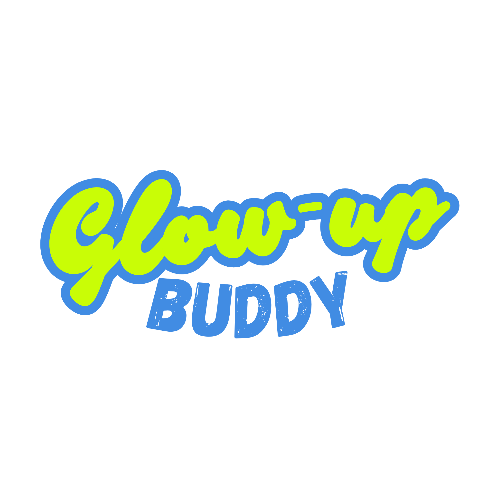

<p align="center">
  
</p>

<h1 align="center">GlowUpBuddy</h1>

<p align="center">
  Your AI-powered daily companion — stay focused, feel good, and glow up every day.
</p>

<p align="center">
  
  
  
  
  
</p>

---

## About

GlowUpBuddy is an AI agent that lives inside **Telegram**. Drop a voice note or message with what's on your plate and it turns chaos into a clear, motivating plan for the day — then checks in with you throughout to keep you on track.

Built for the **Google Rapid Agent Hackathon 2026**, it combines Gemini's reasoning, Google Calendar awareness, and a reward system to make personal productivity feel less like work.

---

## Features

| Feature | What it does |
|---|---|
| **Voice & Text Intake** | Send a voice note or message — Gemini transcribes and parses your tasks automatically |
| **Smart Daily Plans** | Builds a prioritized to-do list that fits around your real Google Calendar blocks |
| **Emotional Check-ins** | Sends motivational nudges and wellbeing pings throughout the day |
| **Bingo Reward Board** | Tracks milestones and unlocks real discount coupons when you hit them |
| **Evening Reflection** | Wraps up your day with a summary and reflection prompt |
| **Obsidian Sync** | Optionally syncs tasks and plans to your Obsidian Kanban board |
| **User Profiles** | Remembers your goals, habits, and preferences across sessions |

---

## Repo Structure

```
glowupbuddy/
├── backend/      # FastAPI app — agents, services, routes, tools
└── frontend/     # React/JSX UI components and app screens
```

---

## Tech Stack

| Layer | Tech |
|---|---|
| Agent | Google Gemini + Agent Builder |
| Chat Interface | Telegram Bot API |
| Backend | FastAPI + Cloud Run |
| Database | MongoDB Atlas |
| Auth | Google OAuth 2.0 |
| Secrets | Google Secret Manager |

---

## Getting Started

```bash
# 1. Clone the repo
git clone https://github.com/anishashruti/glowupbuddy.git
cd glowupbuddy

# 2. Set up the backend
cd backend
cp .env.example .env   # fill in your keys
uv sync
uv run uvicorn main:app --reload
```

See `backend/.env.example` for all required environment variables.

---

## License

MIT © GlowUpBuddy — Built for the Google Rapid Agent Hackathon 2026
